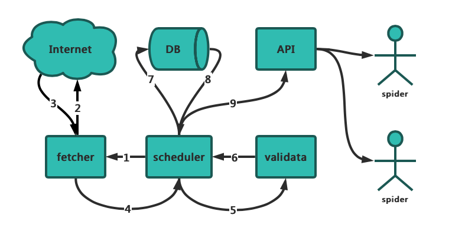

## IP代理池

### 1. 代理IP从何而来

刚自学爬虫的时候没有代理IP就去西刺、快代理之类有免费代理的网站去爬，还是有个别代理能用。当然，如果你有更好的代理接口也可以自己接入。
免费代理的采集也很简单，无非就是：访问页面页面 —> re/json/xpath提取 —> 保存

### 2. 如何保证代理质量

可以肯定免费的代理IP大部分都是不能用的，不然别人为什么还提供付费的(不过事实是很多代理商的付费IP也不稳定，也有很多是不能用)。所以采集回来的代理IP不能直接使用，可以写检测程序不断的去用这些代理访问一个稳定的网站，看是否可以正常使用。

### 3. 代理池设计



- DB 数据管理
  - Mongo
- Fetcher 数据下载
  - 快代理
  - 云代理
  - 全球代理
- Validata 数据验证
  - httpbin.org
  - 指定网站
- Request 下载器
  - 专门下载工具
- Scheduler 调度器
  - 协调各工具的使用
- API API接口开发
  - FastAPI
    - 获取IP
    - 获取IP个数

 

### 4. logging模块使用

logging模块是Python内置的标准模块，主要用于输出运行日志，可以设置输出日志的等级、日志保存路径、日志文件回滚等；相比print，具备如下优点：

1. 可以通过设置不同的日志等级，在release版本中只输出重要信息，而不必显示大量的调试信息；
2. print将所有信息都输出到标准输出中，严重影响开发者从标准输出中查看其它数据；logging则可以由开发者决定将信息输出到什么地方，以及怎么输出；

#### 4.1 基本使用

> 配置logging基本的设置，然后在控制台输出日志

```python
import logging

logger.info("Start print log")
logger.debug("Do something")
logger.warning("Something maybe fail.")
logger.info("Finish")
```

logging中可以选择很多消息级别，如debug、info、warning、error以及critical。通过赋予logger或者handler不同的级别，开发者就可以只输出错误信息到特定的记录文件，或者在调试时只记录调试信息。

例如，我们将logger的级别改为Warning，再观察一下输出结果，

```
logging.basicConfig(level = logging.DEBUG,format = '%(asctime)s - %(name)s - %(levelname)s - %(message)s')
```

#### 4.2 日志输出到文件

```python
logging.basicConfig(filename='./my.log')
```


