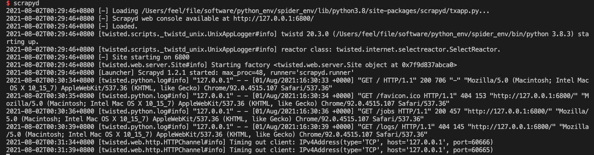
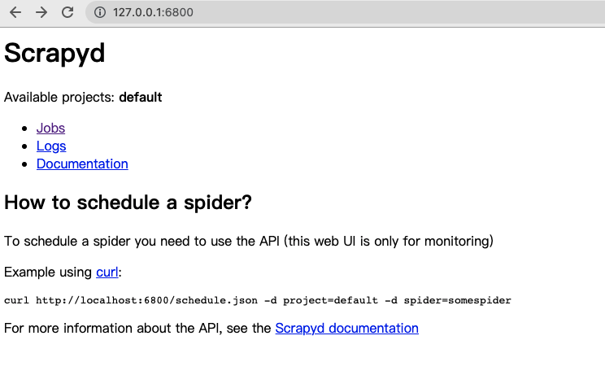
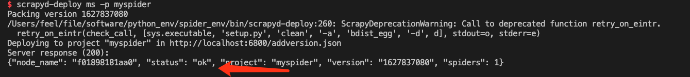
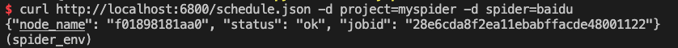

## Scrapyd的安装与使用

[Scrapyd — Scrapyd 1.2.0 documentation](https://scrapyd.readthedocs.io/en/latest/index.html#)

scrapyd是一个用于部署和运行scrapy爬虫的程序，它允许你通过JSON API来**部署爬虫项目和控制爬虫运行**，scrapyd是一个守护进程，监听爬虫的运行和请求，然后启动进程来执行它们

### 1. 安装scrapyd
```shell
 pip install scrapyd 
```
### 2. 部署工程

#### 2.1 启动scrapyd

在本工程下命令行下启动scrapyd

```shell
scrapyd
```





> **注意：** 如果不先启动scrapyd就会无法部署工程

scrapyd的配置文件：`/usr/local/lib/python3.9/site-packages/scrapyd/default_scrapyd.conf`

配置文件选项

```shell
[scrapyd]
# 项目eggs生成目录
eggs_dir    = eggs
# 项目日志生成目录，如果不想要生成日志，可以直接设置成空
logs_dir    = logs
# 爬取的items存储的文件夹，默认为空，不存储。
items_dir   =
# 每个爬虫保持的完成任务数
jobs_to_keep = 5
# 项目dbs生成目录
dbs_dir     = dbs
# 可启用的最多进程数
max_proc    = 0
# 每个CPU可启用的scrapy进程数
max_proc_per_cpu = 4
# 保持的完成任务进程数
finished_to_keep = 100
# 轮训请求队列的时间间隔
poll_interval = 5.0
# 网页和json服务监听的IP地址,推荐改为 0.0.0.0
bind_address = 127.0.0.1
# 监听的端口，默认为 6800
http_port   = 6800
# 是否打开 debug 模式
debug       = off
```

#### 2.2 创建项目

>工程下会有一个叫scrapy.cfg的文件，文件的内容如下：

```
[settings]
default = my_spider.settings

[deploy:ms]  # demo是指这个deploy的名称，自己命名，可以多个。（后面有用到） 
url = http://localhost:6800/
project = myspider  # 工程的名称
```


#### 2.3 部署项目

> 通过scrapyd-deploy部署，要求装一个scrapyd-client

```
pip install scrapyd-client
```
#### 2.4 使用scrapyd-deploy

 **scrapyd-deploy 部署名称 -p 项目名称**

> 在项目路径下执行

```
scrapyd-deploy -l
scrapy-deploy demo  #demo就是scrapy.cfg中的名字
```



### 3 运行Spider

```
curl http://localhost:6800/schedule.json -d project=项目名 -d spider=爬虫名

curl http://192.168.126.131:6800/schedule.json -d project=myspider -d spider=baidu
```



### 4 查看效果


### 5 其它接口

```shell
# 停止爬虫
curl http://localhost:6800/cancel.json -d project=项目名称 -d job=jobid
# 列出项目
curl http://localhost:6800/listprojects.json
# 列出爬虫
curl http://localhost:6800/listspiders.json?project=myspider
# 列出job
curl http://localhost:6800/listjobs.json?project=myspider
```


### 6 可能遇到的问题

**问题1**


**解决方案**

创建文件 `scrapyd-deploy.bat`

```shell
@echo off
D:\python_env\spider_env\Scripts\python D:\python_env\spider_env\Scripts\scrapyd-deploy %*
```


**问题2**


**解决方案**

找到指定文件 修改编码为`utf-8`

```shell
with open(filename, encoding='utf-8') as fp:
	self._read(fp, filename)
```

**问题3**


**解决方案**

因为`scrapy.utils.http`被抛弃了，所以把 scrapyd-deploy文件中 23行的内容 换成`from w3lib.http import basic_auth_header`


