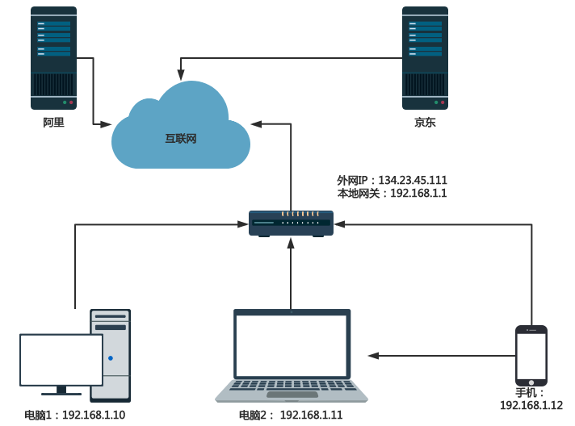

## 移动端爬虫

爬虫除了 Web 网页，也可以抓取 App 的数据。App 中的页面要加载出来，首先需要获取数据，而这些数据一般是通过请求服务器的接口来获取的。由于 App 没有浏览器这种可以比较直观地看到后台请求的工具，所以主要用一些抓包技术来抓取数据

### 1. 抓包工具的安装

Fiddler是一个http协议调试代理工具，它能够记录并检查所有你的电脑和互联网之间的http通讯，设置断点，查看所有的进出Fiddler的数据（指cookie,html,js,css等文件)

Fiddler 要比其他的网络调试器要更加简单，因为它不仅仅暴露http通讯还提供了一个用户友好的格式

**下载地址：**

[Download Fiddler Web Debugging Tool for Free by Telerik](https://www.telerik.com/download/fiddler)

#### 1.1 安装

#### 1.2 配置Fiddler

- 设置允许远程连接，勾选Allow remote computers to connect，默认的端口为8888.

- fiddler默认只抓取http协议的请求，需要修改配置实现抓取https协议的请求

  勾选Decypt HTTPS traffic，会有证书安装的窗口弹出，都选择YES，全部配置完成后重启fiddler

### 2. 模拟器配置

夜神模拟器

官网： [夜神安卓模拟器-安卓模拟器电脑版下载-官网 (yeshen.com)](https://www.yeshen.com/)

#### 2.1 配置手机

